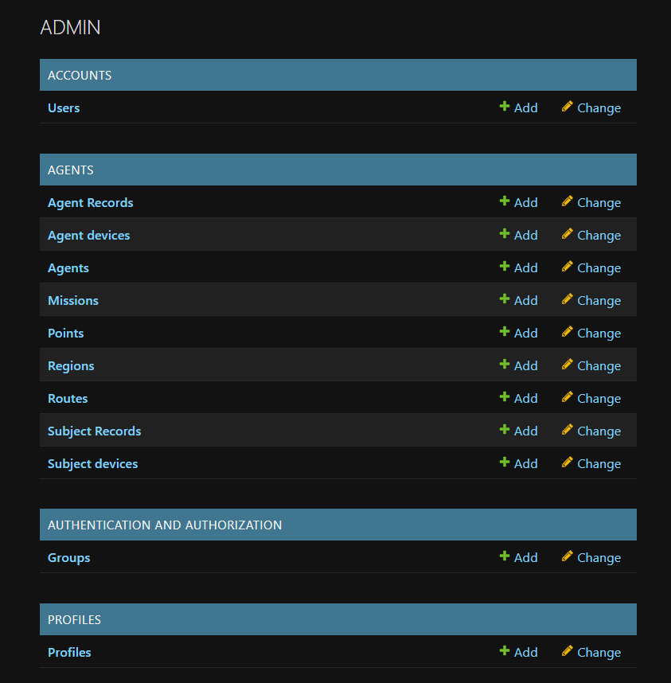
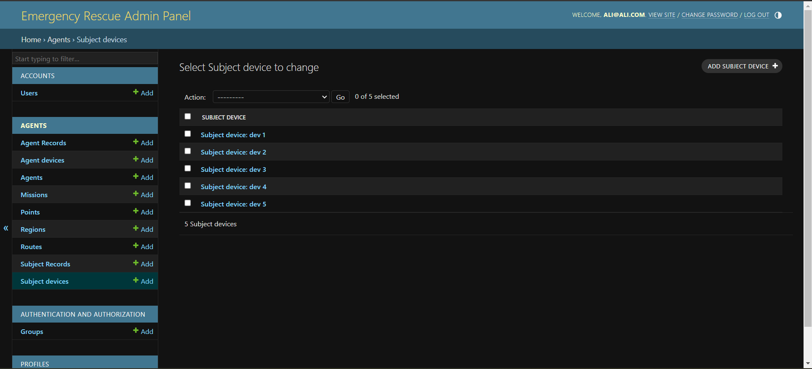
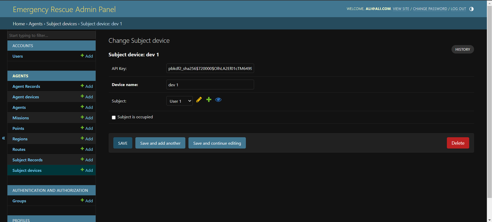
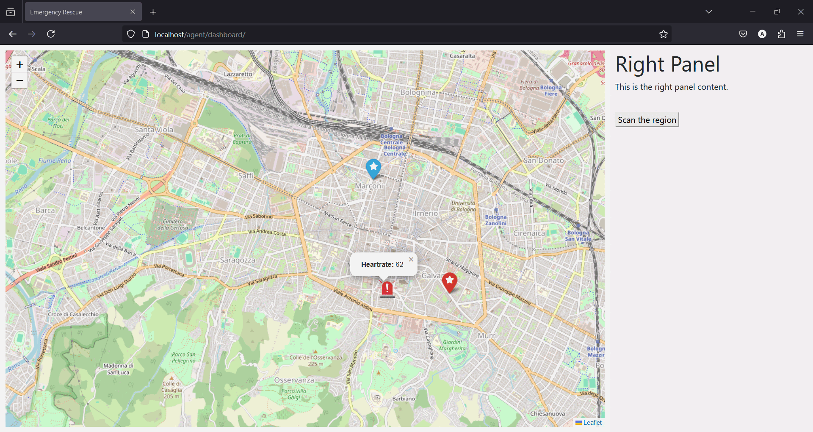

# **Emergency Rescue Platform**

## **Project Status** 🚧
**Currently in development**  
This project is actively being improved and expanded. New features and enhancements are in progress!

---

## **Project Description**
The **Emergency Rescue Platform** is a backend system designed to support disaster response efforts by identifying and rescuing individuals trapped under rubble (e.g., post-earthquake scenarios). The platform integrates with custom devices capable of transmitting critical information, such as location and vital signs, even under rubble. This data is processed and sent to the nearest emergency centers to facilitate timely rescue operations.

---

## **How It Works**
1. **Data Transmission**:  
   Custom devices broadcast signals containing:
   - Location data (latitude and longitude).
   - Vital signs (e.g., heart rate).

2. **Data Processing**:  
   The platform processes this data through RESTful APIs and stores it in a geospatial database.

3. **Automated Workflow**:  
   The system matches the trapped individual with the nearest emergency center and assigns an agent for rescue.

4. **Real-Time Updates**:  
   Tracks and updates the mission status, ensuring that emergency centers can monitor operations dynamically.

---

## **How to Run the Project**

### **Configuring the `.env` File**

To run the project, you need to create a `.env` file from the provided `.env.example` file. This file contains essential configuration keys required by the application. Follow these steps:

1. **Create the `.env` File**:  
   Copy the `.env.example` file to a new file named `.env`:  
   ```bash
   cp .env.example .env
   ```

2. **Set the Configuration Keys**:
    `SECRET_KEY`:
    Add a secret key for your Django application. You can generate one using an online tool
    ```bash
    SECRET_KEY=your_secret_key_here
    ```
    `DEBUG`:
    Set this to True for development mode or False for production
    ```bash
    DEBUG=True
    ```

3. **PostgreSQL Configuration**:
    Provide the database credentials for PostgreSQL:
    ```bash
    NAME=your_database_name
    USER=your_database_user
    PASSWORD=your_database_password
    HOST=your_database_host
    PORT=5432  # Default PostgreSQL port
    ```

4. **Redis Configuration**:
    Set the Redis host name or IP address:
    ```bash
    REDIS_HOST=your_redis_host
    ```

5. **Django Superuser Configuration**:
    Define the default superuser's details (you can change these values as needed):
    ```bash
    DJANGO_SUPERUSER_EMAIL=admin@admin.com
    DJANGO_SUPERUSER_FIRSTNAME=Admin
    DJANGO_SUPERUSER_LASTNAME=Admin
    DJANGO_SUPERUSER_PASSWORD=123
    ```

6. **Docker Volumes**:
    Specify the names of the Docker volumes used for PostgreSQL data and static files. Use the same names provided here to ensure compatibility with the default `docker-compose` commands:
    ```bash
    DOCKER_VOLUME1=pgdata
    DOCKER_VOLUME2=static_volume
    ```

7. **Django Settings Module**:
    Set this key to switch between development and production environments:

    Use **resc.settings.development** for development mode, where all services (database, Redis, Django, Celery, etc.) are run manually.

    Use **resc.settings.production** for production mode, where `docker-compose` can be used to start all services quickly.

    ```bash
    DJANGO_SETTINGS_MODULE=resc.settings.development
    ```
    ```bash
    DJANGO_SETTINGS_MODULE=resc.settings.production
    ```

A sample `.env` file:
```bash
SECRET_KEY=
DEBUG=True
NAME=rescue
USER=postgres
PASSWORD=rescue12345
HOST=db
PORT=5432
REDIS_HOST=ram
DJANGO_SUPERUSER_EMAIL=admin@admin.com
DJANGO_SUPERUSER_FIRSTNAME=Admin
DJANGO_SUPERUSER_LASTNAME=Admin
DJANGO_SUPERUSER_PASSWORD=123
DOCKER_VOLUME1=pgdata
DOCKER_VOLUME2=static_volume
DJANGO_SETTINGS_MODULE=resc.settings.production

```
You only have to add the `SECRET_KEY` here.

### **Running the Application in Production Mode (with Docker)**

This mode is recommended if you want to quickly run the project and see the app in action. To run the app in production mode, you need to have Docker and Docker Compose installed, along with the required Docker images specified in the `docker-compose.yml` file.

Follow these steps to set up the app:

1. **Create Docker Volumes and Networks**:
    Create the required Docker volumes for data and static files, as well as a network for the app:
    ```bash
    docker volume create pgdata
    docker volume create static_volume
    docker network create app-network
    ```

2. **Start Docker Compose**:
    Build and start the services using Docker Compose:
    ```bash
    docker-compose up --build -d
    ```

3. **Optional but Recommended Commands**:
    Flush the Database (except Superuser): To clear the database while keeping the superuser, use the following command
    ```bash
    docker-compose exec web python /app/resc/manage.py flush_except_superuser
    ```
    Load Fixtures: To load initial data into the database, run the following command, replacing `data_new.json` with the fixture file you want to load
    ```bash
    docker-compose exec web python /app/resc/manage.py load_my_data data_new.json --exclude contenttypes
    ```

### **Running the Application in Development Mode**

Running the application in development mode is recommended for those who wish to modify or expand its functionality. In this mode, you must manually configure and start each service individually.

1. **Configure PostgreSQL with PostGIS Extension**:  
   As the application utilizes GeoDjango, it is necessary to create the `PostGIS` extensions for your PostgreSQL database.

   - **For Windows Users**: Ensure that the GDAL library is correctly configured, as it is required for GeoDjango. Detailed instructions can be found in this [Guide](https://medium.com/@limeira.felipe94/gdal-configuration-and-installation-on-windows-for-django-projects-538171db5ccc).

2. **Initialze Redis Database**

3. **Run the Django Application**:  
   Ensure you have installed a tool for creating isolated Python environments. We recommend using `virtualenv`, which can be installed using the following command:  
   ```bash
   pip install virtualenv
   ```

    - **Create the Virtual Environment**:
        ```bash
        virtualenv venv
        ```
    - **Install the Requirements**:
        ```bash
        pip install -r requirements.txt
        ```
    - **Activate the virtual environment**:
        For windows users:
        ```bash
        .\venv\Scripts\Activare
        ```
        For linux users:
        ```bash
        source venv/bin/activate
        ```
    - **Run the App**:
        Navigate to the directory containing the *manage.py* file and execute:
        ```bash
        python manage.py runserver
        ```

4. **Run the Celery Application**:
    In another terminal, activate the virtual environment and navigate to the directory containing the *manage.py* file.
    For windows users:
    ```bash
    celery -A resc worker -l info --pool=solo
    ```
    For linux users:
    ```bash
    celery -A resc worker --loglevel=info
    ```

5. **Optional but Recommended Commands**:
    Flush the Database (except Superuser): To clear the database while keeping the superuser, use the following command
    ```bash
    python manage.py flush_except_superuser
    ```
    Load Fixtures: To load initial data into the database, run the following command, replacing `data_new.json` with the fixture file you want to load
    ```bash
    python manage.py load_my_data data_new.json --exclude contenttypes
    ```

---

## **What you will see**

If you have done everything correctly, in *production* mode the base url will be *http://localhost/* and in *developement* mode, *http://localhost:8000/*.

### **Admin page**:

When the application is up and running, you can go to the url */admin/* and log into admin panel with username and password you had previously added to `.env` file. If you have done the recommended loading of fixtures, you can expect to see the admin panel as below:


Admin Panel



Instance added by fixture to SubjectDevice model


Details of a SubjectDevice Instance

### **Emergency Center Dashboard**

The Emergency Center Dashboard allows emergency centers to monitor all operations in real-time. This includes data sent by the devices of agents (e.g., ambulances) and subjects in need of help (e.g., individuals under rubble).  

To view how data is monitored:  
1. Navigate to the login page at `account/login/`.  
2. Log in using the following credentials:  
   - **Username:** emergency-center1@resc.com  
   - **Password:** 123  
3. After logging in, you will be redirected to a real-time map of the city of **Bologna** at `agent/dashboard/`. This dashboard provides a comprehensive overview of all monitored activities and locations.

<figure>
  
  <figcaption>Icon used for Agents</figcaption>
  <br>
  
  <figcaption>Icon used for Subjects</figcaption>
  <br>
  
  <figcaption>Icon used for Emergency-Centers</figcaption>
</figure>

To simulate the functionality of the devices, two scripts have been created and are located in the `communication-scripts` folder:  
- One script mimics the devices used by agents (e.g., ambulances).  
- The other script mimics the devices used by subjects in need of assistance (e.g., individuals under rubble).  

These scripts communicate directly with the backend system, emulating real-world data transmission. The `GIF` below demonstrates what the user *Emergency-center 1* sees on their dashboard panel. 

